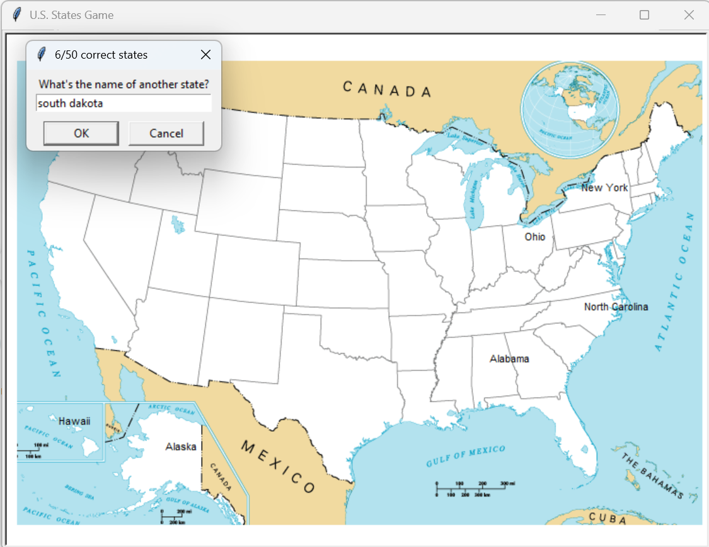

# U.S. States Guessing Game

An interactive geography quiz built with Python using Turtle graphics and Pandas.

## Features

- Guess all 50 U.S. states

- Correct guesses appear on the map

- Case-insensitive input handling

- Generates a CSV file of missed states for review

## Technologies

Python, Turtle Graphics, Pandas

## How to Run

1\. Install pandas

2\. Run main.py

## Game Preview

The game prompts the user to guess U.S. states. Correct guesses are labeled dynamically on the map.

